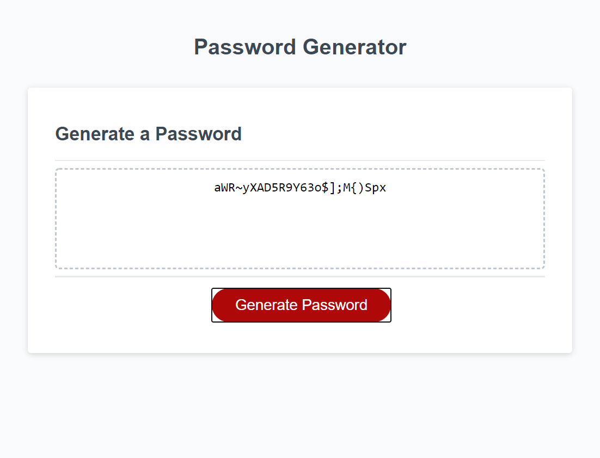
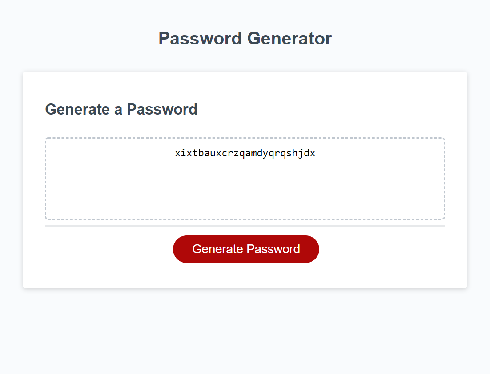
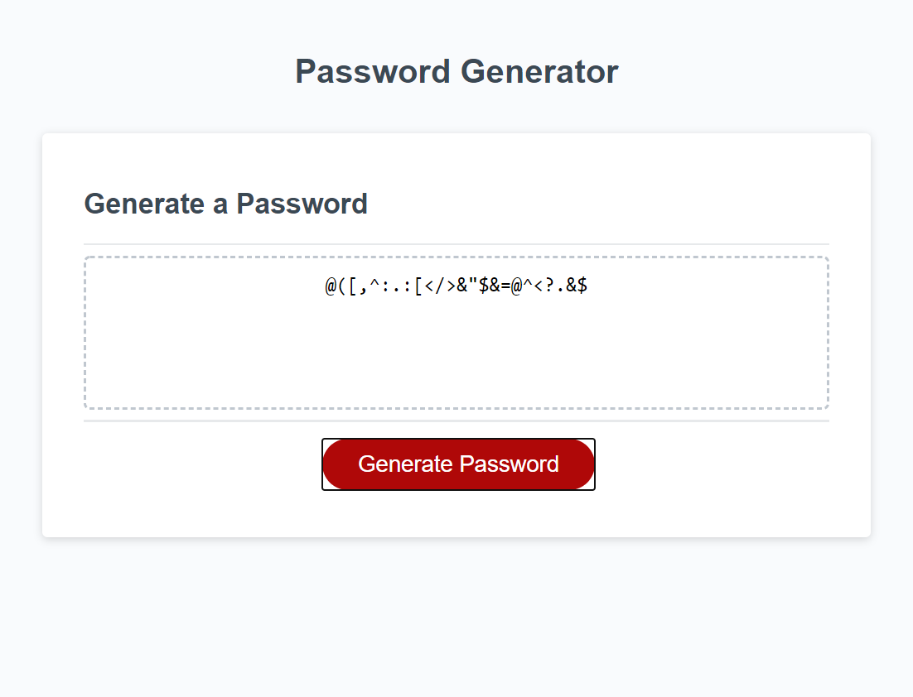

# Javascript: Password Generator

An online random password generator that creates bespoked passwords based on the users specifications. User can select how long they want their password and which character types to use. Users can then copy the password to the clipboard and paste it where it is needed.

## Deployment

https://conanas.github.io/javascript-password-generator/

## Screenshots

##### Welcome Screen

##### All Characters

##### Lower Case

##### Special Characters

